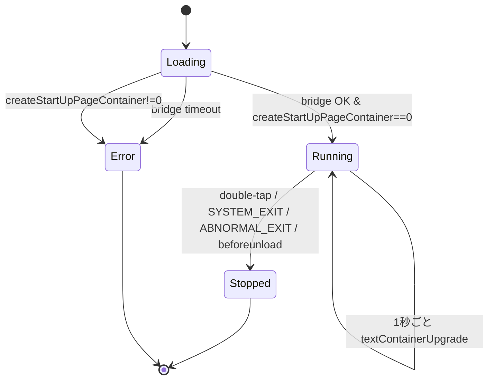

# feat-002 機能設計書: デジタル時計風表示

## 1.1 対応要求マッピング

| 要求ID | 概要 | 本設計書のセクション |
|--------|------|----------------------|
| FR-001 | デジタル時計の初期表示 | 4.1 起動・初期表示 / 4.2 時刻フォーマット |
| FR-002 | 時刻の毎秒自動更新 | 4.3 更新ループ / 4.2 時刻フォーマット |
| FR-003 | ダブルタップによる終了 | 4.4 イベント処理・終了 |

## 1.2 システム構成

feat-001 の `app/` をそのまま土台とし、`app/src/main.ts` をデジタル時計に置き換える。ファイル追加は行わず単一ファイルで完結させる(機能が小さく、純粋関数と副作用処理を1ファイル内で分離できるため)。

```
app/
├── index.html          # 変更なし(#app を持つ既存 HTML)
├── src/
│   ├── main.ts         # ★本案件で全面改修。時刻表示・更新ループ・終了処理
│   └── vite-env.d.ts   # 変更なし
├── package.json        # 変更なし(依存・スクリプト追加なし)
├── tsconfig.json       # 変更なし
└── vite.config.ts      # 変更なし
```

### モジュール内の責務分割(main.ts 内)

- **純粋関数 `formatClock(date: Date): string`**: `Date` → 時刻文字列 `HH:MM:SS`。副作用なし。テスト対象の中核。
- **`main()` 非同期関数**: ブリッジ取得 → 初期コンテナ作成 → 更新ループ開始 → イベント購読。
- **`startClockLoop()` / `stopClockLoop()`**: 更新ループの開始・停止(`setInterval` / `clearInterval`)。
- **`renderTime()`**: 現在時刻を生成し `textContainerUpgrade()` で反映(直列化付き)。

依存方向: `main()` → `startClockLoop()` → `renderTime()` → `formatClock()`。循環依存なし。

## 1.3 技術スタック

feat-001 から継続。新規追加・変更なし。

- **言語**: TypeScript `~6.0.3`(`strict: true`、vanilla)
- **ライブラリ**: `@evenrealities/even_hub_sdk` 0.0.10、Vite `^8.0.16`(dev/build)、`@evenrealities/evenhub-simulator` 0.7.3(devDependencies)
- **パッケージ管理**: npm(`app/package.json`)
- **選定理由**: feat-001 で構築・実証済みの構成を流用し、変更範囲を `main.ts` に限定するため。

## 1.4 各機能の詳細設計

### 定数定義(main.ts 冒頭)

マジックナンバー禁止のため冒頭で定数化する。

```typescript
const BRIDGE_TIMEOUT_MS = 8000;      // feat-001 から継続
const UPDATE_INTERVAL_MS = 1000;     // 更新ループ間隔
const CONTAINER_ID = 1;              // 時刻表示コンテナのID
const CONTAINER_NAME = 'clock';      // 最大16文字
const SHUTDOWN_EXIT_MODE = 1;        // 1=前面レイヤをポップしユーザー操作待ち(公式テンプレート慣習)
// コンテナのレイアウト(中央寄せ)。feat-001 の Hello World と同系の配置
const CLOCK_X = 138;
const CLOCK_Y = 104;
const CLOCK_W = 300;
const CLOCK_H = 80;
```

### 4.2 時刻フォーマット(FR-001, FR-002)

#### データフロー

- 入力: `Date` インスタンス(`new Date()` で取得した実行 PC のローカル時刻)。
- 出力: `string`、形式 `HH:MM:SS`、24時間制、各フィールド2桁ゼロ埋め。値域 `00:00:00`〜`23:59:59`。長さ常に8バイト。

#### 処理ロジック

```typescript
// 意図の伝達用。getHours/Minutes/Seconds はローカル時刻を返す
function formatClock(date: Date): string {
  const pad = (n: number): string => n.toString().padStart(2, '0');
  return `${pad(date.getHours())}:${pad(date.getMinutes())}:${pad(date.getSeconds())}`;
}
```

- `getHours()` は 0〜23 を返す(24時間制そのもの。変換不要)。
- `padStart(2, '0')` で1桁を2桁ゼロ埋め(例: 9 → `09`)。

#### 境界条件

- 0時0分0秒 → `00:00:00`。
- 23時59分59秒 → `23:59:59`。
- いずれも8文字固定。桁あふれは `Date` の仕様上発生しない。

### 4.1 起動・初期表示(FR-001)

#### 処理ロジック(ステップ)

1. `console.log('[clock] page loaded')`。
2. `waitForBridgeWithTimeout(BRIDGE_TIMEOUT_MS)` でブリッジ取得(feat-001 のヘルパを継続使用)。タイムアウト時は `console.error` で「シミュレータで開け」を促し `return`(以降の処理を行わない)。
3. 初期の時刻文字列 `formatClock(new Date())` を生成。
4. `createStartUpPageContainer()` を呼び、テキストコンテナ1つを作成する:
   - `containerTotalNum: 1`
   - `textObject: [ new TextContainerProperty({ xPosition: CLOCK_X, yPosition: CLOCK_Y, width: CLOCK_W, height: CLOCK_H, containerID: CONTAINER_ID, containerName: CONTAINER_NAME, content: <初期時刻文字列>, isEventCapture: 1 }) ]`
   - `isEventCapture: 1`(コンテナが1つなので唯一のイベントキャプチャ。FR-003 のダブルタップ受信に必須)。
5. 戻り値判定: `0`=Success ならログ出力して続行。`1/2/3`(Invalid/Oversize/OutOfMemory)なら `console.error` で意味付きログを出し、更新ループを開始せず `return`(feat-001 と同じエラーマップを流用)。
6. 成功後、更新ループ開始(4.3)とイベント購読(4.4)を行う。

#### エラーハンドリング

| エラー | 検出方法 | 処理 |
|--------|----------|------|
| ブリッジ未取得(タイムアウト) | `waitForBridgeWithTimeout` の reject | `console.error('[clock] bridge not available ...')`、`return`(表示しない) |
| コンテナ作成失敗 | `createStartUpPageContainer` の戻り値 `!== 0` | `console.error('[clock] createStartUpPageContainer failed: result=N (意味)')`、ループ開始せず `return` |

### 4.3 更新ループ(FR-002)

#### 処理ロジック

- `renderTime()`: 現在時刻を反映する。ブリッジ書き込みを**直列化**(text-heavy テンプレート方式)してオーバーラップを防ぐ:

```typescript
// 意図の伝達用。直列化で前回更新の完了を待ってから次を投げる
let rendering: Promise<unknown> = Promise.resolve();
function renderTime(): void {
  const content = formatClock(new Date()); // 毎回読み直す(ドリフトを表示に持ち込まない)
  rendering = rendering
    .then(() =>
      bridge.textContainerUpgrade(
        new TextContainerUpgrade({
          containerID: CONTAINER_ID,
          containerName: CONTAINER_NAME,
          content,
        }),
      ),
    )
    .catch((err) => {
      // 単発失敗はログのみ。ループは継続し次秒で復帰を試みる(非機能要求:信頼性)
      console.error('[clock] textContainerUpgrade failed:', err);
    });
}
```

- `startClockLoop()`: `intervalId = setInterval(renderTime, UPDATE_INTERVAL_MS)`。`intervalId` はモジュールスコープに保持。
- `stopClockLoop()`: `intervalId` が存在すれば `clearInterval(intervalId)` し `intervalId = null` にする(冪等)。

#### 重要設計判断

- **毎回 `new Date()` を読み直す**: `setInterval` は厳密に1秒間隔ではなく遅延が累積し得る。表示は常に「その瞬間の実時刻」を出すことで累積ドリフトを表示へ持ち込まない(非機能要求の時刻精度 ±2秒)。
- **初期表示と更新の二重描画を避ける**: `createStartUpPageContainer` で初期時刻を表示済みのため、`setInterval` は次の1秒後から発火すればよい。起動直後の追加 `renderTime()` 即時呼び出しは行わない(初期表示と重複し無駄なため)。

#### 境界条件

- `textContainerUpgrade` が `false` を返した/例外を投げた場合: `catch` でログのみ。`rendering` チェーンは `catch` で解決済みになるため次回更新は正常に継続する。
- 終了後(4.4)に万一 `renderTime` が走らないよう、`stopClockLoop()` で `clearInterval` 済みであることを保証する。

### 4.4 イベント処理・終了(FR-003)

#### 処理ロジック

`bridge.onEvenHubEvent(handler)` で購読する。返り値 `unsubscribe` をモジュールスコープに保持。

```typescript
// 意図の伝達用。Protobuf はゼロ値を省くため ?? null で coalesce する
const unsubscribe = bridge.onEvenHubEvent((event) => {
  const sysType = event.sysEvent?.eventType ?? null;
  const textType = event.textEvent?.eventType ?? null;

  // ダブルタップ → 終了(どちらの envelope でも受ける)
  if (
    sysType === OsEventTypeList.DOUBLE_CLICK_EVENT ||
    textType === OsEventTypeList.DOUBLE_CLICK_EVENT
  ) {
    cleanup();
    bridge.shutDownPageContainer(SHUTDOWN_EXIT_MODE);
    return;
  }

  // ライフサイクル終了 → 後始末
  if (
    sysType === OsEventTypeList.SYSTEM_EXIT_EVENT ||
    sysType === OsEventTypeList.ABNORMAL_EXIT_EVENT
  ) {
    cleanup();
  }
});
```

- `cleanup()`(冪等): `stopClockLoop()` を呼び更新ループを停止し、`unsubscribe()` でイベント購読を解除する。`cleanedUp` フラグで二重実行を防ぐ。
- `window.addEventListener('beforeunload', cleanup)` も登録し、ページ破棄時の後始末を保証する。
- `DOUBLE_CLICK_EVENT` の値は `3`(SDK `OsEventTypeList`)。`SYSTEM_EXIT_EVENT`=7、`ABNORMAL_EXIT_EVENT`=6。

#### エラーハンドリング・境界条件

- ゼロ値イベント(例 `CLICK_EVENT`=0)はワイヤ上 `undefined` で届くため、`?? null` で coalesce してから比較する(誤判定防止)。本案件はクリック単発に反応しないので実害は小さいが、慣習に従い coalesce する。
- ダブルタップ後に追加でイベントが届いても `cleanedUp` フラグにより `cleanup()` は1回しか実行されない。
- `shutDownPageContainer(1)` は前面レイヤをポップしユーザー操作待ち(`exitMode` 0=即終了 / 1=ユーザー操作待ち。公式テンプレートに合わせ 1)。

## 1.5 状態遷移

状態一覧:

- **Loading**: ブリッジ取得待ち。
- **Running**: コンテナ作成済み・更新ループ稼働中。
- **Stopped**: 終了処理済み(ループ停止・購読解除)。
- **Error**: ブリッジ取得失敗 or コンテナ作成失敗(表示せず終了)。



- 遷移トリガー: Loading→Running は「ブリッジ取得成功かつコンテナ作成成功」。Running→Stopped は「ダブルタップ or ライフサイクル終了 or ページ破棄」。
- 不正遷移: Stopped 後に `renderTime` が呼ばれることはない(`clearInterval` 済み)。万一呼ばれても `textContainerUpgrade` 失敗は `catch` で握る。

## 1.6 ファイル・ディレクトリ設計

- 入出力ファイルなし。設定ファイルの追加・変更なし。
- automation API のスクリーンショットは検証時に CWD/一時領域へ保存する(成果物ではない。`tmp/` を使う)。

## 1.7 インターフェース定義

main.ts 内の関数(すべてモジュールローカル、外部公開なし):

| 関数 | シグネチャ | 責務 |
|------|-----------|------|
| `formatClock` | `(date: Date) => string` | 時刻 → `HH:MM:SS` 文字列(純粋関数) |
| `waitForBridgeWithTimeout` | `(timeoutMs: number) => Promise<EvenAppBridge>` | ブリッジ取得(feat-001 から継続) |
| `renderTime` | `() => void` | 現在時刻を直列化付きで反映 |
| `startClockLoop` | `() => void` | `setInterval` 開始 |
| `stopClockLoop` | `() => void` | `clearInterval`(冪等) |
| `cleanup` | `() => void` | ループ停止 + 購読解除(冪等) |
| `main` | `() => Promise<void>` | 起動オーケストレーション |

使用する SDK API(型定義より):

- `waitForEvenAppBridge(): Promise<EvenAppBridge>`
- `bridge.createStartUpPageContainer(c: CreateStartUpPageContainer): Promise<number>`(0=Success)
- `bridge.textContainerUpgrade(c: TextContainerUpgrade): Promise<boolean>`
- `bridge.shutDownPageContainer(exitMode?: number): Promise<boolean>`
- `bridge.onEvenHubEvent(cb: (e: EvenHubEvent) => void): () => void`(返り値=unsubscribe)
- `OsEventTypeList.DOUBLE_CLICK_EVENT`(3)/ `SYSTEM_EXIT_EVENT`(7)/ `ABNORMAL_EXIT_EVENT`(6)

## 1.8 ログ・デバッグ設計

- ログプレフィックスは `[clock]`(feat-001 の `[hello]` に倣う)。
- ログレベルの使い分け:
  - **INFO(`console.log`)**: `page loaded` / `bridge acquired` / `displayed: <初期時刻>` / `cleanup done`。
  - **ERROR(`console.error`)**: ブリッジ取得失敗 / コンテナ作成失敗(result と意味) / `textContainerUpgrade` 失敗。
- **更新ループのログ方針**: 毎秒の `renderTime` 成功ログは出さない(コンソールが溢れ automation API の `/api/console` 検証を阻害するため)。失敗時のみ ERROR を出す。
- 検証は automation API(`/api/screenshot/glasses` を間隔をあけ複数回、`/api/console` でエラー有無)で行う。

## 設計判断の記録(ADR 簡易版)

- **採用: 単一 `main.ts` に純粋関数 `formatClock` を同居**。却下案: `clock.ts` 等への分割。理由: 機能が小さく1ファイルで責務分離でき、feat-001 の構造を最小変更で踏襲できる。将来タイマー化で複雑になった時点で分割を再検討。
- **採用: `textContainerUpgrade` による content 差し替え**。却下案: `rebuildPageContainer` で毎秒画面再構築。理由: 位置・構造は不変で content のみ変わるため、部分更新が軽量で「同位置の継続更新」の意図に合致(research.md の更新3手段の使い分け)。
- **採用: 更新ごとに `new Date()` 読み直し**。却下案: 秒カウンタをインクリメント。理由: `setInterval` のドリフト・スリープ復帰でカウンタが実時刻からずれる。実時刻を都度読めば自己修正される。
- **採用: ブリッジ書き込みの直列化(Promise チェーン)**。却下案: 直列化なしで毎秒 `textContainerUpgrade` を投げる。理由: 公式 text-heavy テンプレートが直列化しており、更新の重なり・順序逆転を防ぐ安全策。毎秒1回なら通常重ならないが、シミュレータ/実機の応答遅延に対する保険。
- **採用: `setInterval` の即時初回呼び出しをしない**。却下案: 起動直後に `renderTime()` を1回呼ぶ。理由: `createStartUpPageContainer` で初期時刻を既に表示済みのため重複。次の1秒後の発火で十分。
</content>
