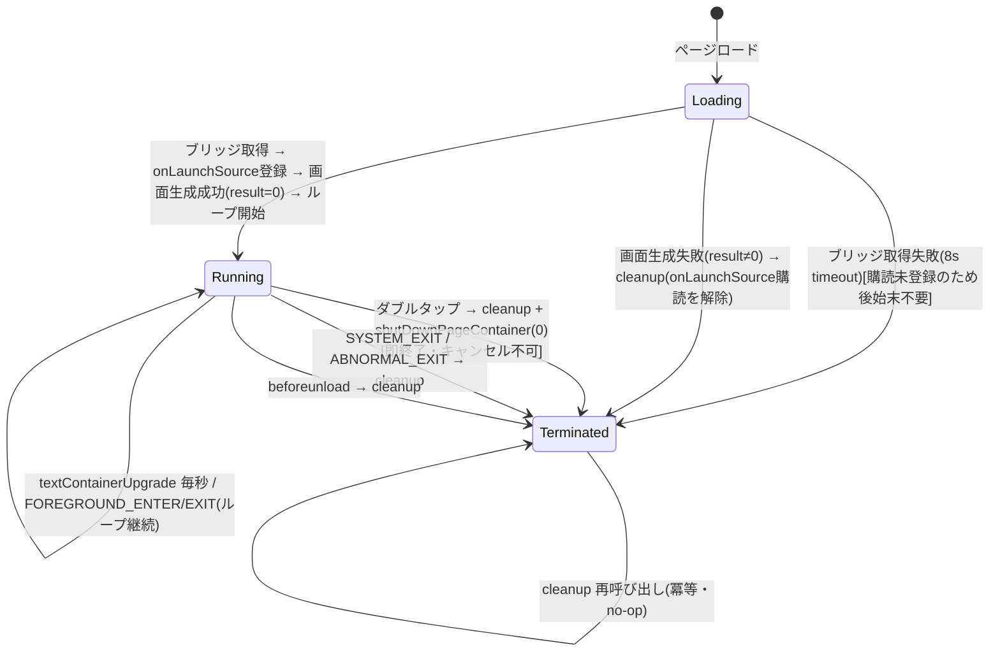

# feat-003 機能設計書: アプリの起動・終了処理

`docs/DESIGN_STANDARD.md` に準拠。本設計書のコード例は意図伝達が目的であり、そのままコピーして使うものではない。

## 1. 対応要求マッピング

| 要求ID | 設計セクション |
|--------|----------------|
| FR-001 ブリッジ取得とタイムアウト | 4.1 |
| FR-002 起動元の判別とログ出力 | 4.2 |
| FR-003 初期画面生成 | 4.3 |
| FR-004 ダブルタップ終了 | 4.4 |
| FR-005 ライフサイクル終了での後始末 | 4.4 |
| FR-006 beforeunload 後始末 | 4.4 |
| FR-007 後始末の冪等性 | 4.4 |
| FR-008 背面化時の更新継続 | 4.5 |
| 状態遷移 | 5 |
| インターフェース定義 | 7 |

## 2. システム構成

- 対象ファイルは `app/src/main.ts` 単一(feat-002 から継続)。新規ファイルは作らない。
- **`bridge` の所有**: feat-002 同様、`bridge` は**モジュールスコープ変数** `let bridge: EvenAppBridge;` として保持する(`main()` 内ローカルにしない)。これにより `registerLaunchSource()` / `handleEvenHubEvent()` / `cleanup()` などモジュール関数から `bridge.*` を参照できる。`bridge` は `main()` 冒頭で代入され、代入前に他関数から参照されることはない(呼び出し順がそれを保証する)ため null ガードは設けない(feat-002 の設計を踏襲)。
- 責務はモジュールレベルの関数群に分割する(1関数1責務):
  - 起動: `main()`(オーケストレーション)、`waitForBridgeWithTimeout()`、`registerLaunchSource()`(新規)、`createInitialPage()`
  - 更新ループ: `renderTime()` / `startClockLoop()` / `stopClockLoop()`(feat-002 既存、本案件で変更なし)
  - 終了: `handleEvenHubEvent()`(イベント振り分け)、`cleanup()`
- 依存方向: `main()` → 各関数(循環なし)。イベントハンドラ → `cleanup()` / `bridge.shutDownPageContainer()`。

```
app/src/main.ts
├── main()                       # 起動オーケストレーション
│   ├── waitForBridgeWithTimeout()   # FR-001
│   ├── registerLaunchSource()       # FR-002(新規)
│   ├── createInitialPage()          # FR-003
│   ├── startClockLoop()             # 既存(更新ループ開始)
│   └── bridge.onEvenHubEvent(handleEvenHubEvent)  # FR-004/005/008
├── handleEvenHubEvent(event)    # イベント振り分け
├── cleanup()                    # FR-007(冪等な後始末)
└── window 'beforeunload' → cleanup  # FR-006
```

## 3. 技術スタック

- 言語: TypeScript `~6.0.3`(strict)。`app/tsconfig.json` 準拠。
- ライブラリ: `@evenrealities/even_hub_sdk` 0.0.10。本案件で**新規に使う API**: `bridge.onLaunchSource(callback)` と型 `LaunchSource`(`'appMenu' | 'glassesMenu'`)。既存 API(`waitForEvenAppBridge`, `createStartUpPageContainer`, `textContainerUpgrade`, `shutDownPageContainer`, `onEvenHubEvent`, `OsEventTypeList`)は feat-002 から継続。
- ビルド/検証: Vite `^8.0.16`(dev server)、`@evenrealities/evenhub-simulator` 0.7.3(automation port 9898)。
- パッケージ管理: npm(`app/package.json`)。新規依存の追加なし(`onLaunchSource` は同一 SDK に同梱)。

## 4. 各機能の詳細設計

### 4.1 ブリッジ取得とタイムアウト(FR-001)

feat-002 から変更なし。`waitForBridgeWithTimeout(BRIDGE_TIMEOUT_MS)` を `main()` 冒頭で await。

- 入力: なし(ページロード時に実行)。
- 出力: `EvenAppBridge`(成功)/ reject(8000ms 超過)。
- ロジック:
  1. `setTimeout` で `BRIDGE_TIMEOUT_MS`(8000)後に reject するタイマーを張る。
  2. `waitForEvenAppBridge()` が解決したら `clearTimeout` して resolve。
  3. `main()` 側は try/catch で reject を捕捉し、`console.error` を出して return(画面生成に進まない)。
- 値域: `BRIDGE_TIMEOUT_MS = 8000`(定数)。

### 4.2 起動元の判別とログ出力(FR-002・新規)

- **登録タイミング**: ブリッジ取得直後、**`createStartUpPageContainer` より前**に登録する。理由: launch source の push は「ロード完了後1回限り」のため、取りこぼしを防ぐ。
- 入力: `bridge.onLaunchSource((source: LaunchSource) => void)` で受け取る `source`(`'appMenu' | 'glassesMenu'`)。
- 出力: `console.log('[lifecycle] launch source: ' + source)`。
- ロジック(擬似コード):

```typescript
// 戻り値の unsubscribe を保持し、cleanup で解除する
function registerLaunchSource(): void {
  unsubscribeLaunch = bridge.onLaunchSource((source) => {
    // 起動元による分岐はしない。記録のみ(将来の分岐・実機デバッグ用)
    console.log(`[lifecycle] launch source: ${source}`);
  });
}
```

- **非ブロッキング**: `onLaunchSource` は購読登録のみで、戻り値(unsubscribe 関数)を `unsubscribeLaunch` に保持する。`main()` は launch source の到着を待たずに次の処理(画面生成)へ進む。通知が来ない環境でも起動処理は成立する(FR-002 受け入れ基準)。
- **購読解除**: `cleanup()` で `unsubscribeLaunch` を呼ぶ(後述 4.4)。
- **設計判断(ADR)**:
  - 採用: 起動元はログ出力のみ・画面分岐しない。
  - 却下: 起動元で初期画面を変える(例: glassesMenu のときだけ別レイアウト)。理由: 現時点で分岐要件がなく、タイマーはどこから起動しても同一画面でよい。将来要件が出たらこのコールバック内に分岐を追加できる構造にしておく。

### 4.3 初期画面生成(FR-003)

feat-002 から変更なし(関数として切り出すかは任意。切り出す場合 `createInitialPage()`)。

- 入力: 取得済み `bridge`。
- 出力: `StartUpPageCreateResult`(0=Success / 1=Invalid / 2=Oversize / 3=OutOfMemory)。
- ロジック:
  1. 初期コンテンツ `formatClock(new Date())` を生成。
  2. `createStartUpPageContainer({ containerTotalNum: 1, textObject: [時計コンテナ(isEventCapture: 1)] })` を await。
  3. 戻り値が `0` 以外なら `CONTAINER_RESULT_MEANING[result]` を添えて `console.error`、**`cleanup()` を呼んでから** `return`(更新ループを開始しない)。これにより 4.2 で登録済みの `onLaunchSource` 購読がリークしない(FR-007 の冪等性により安全)。
  4. `0` なら表示成功ログを出し、更新ループ開始と `onEvenHubEvent` 購読へ進む。
- 境界条件: `createStartUpPageContainer` は起動後1回のみ有効。リロードでの再初期化はシミュレータ再起動で対応(tech_notes 3章)。

### 4.4 終了・後始末(FR-004/005/006/007)

#### イベント振り分け `handleEvenHubEvent(event)`

```typescript
function handleEvenHubEvent(event: EvenHubEvent): void {
  // Protobuf はゼロ値を省くため ?? null で coalesce(誤判定防止)
  const sysType = event.sysEvent?.eventType ?? null;
  const textType = event.textEvent?.eventType ?? null;

  // FR-004: ダブルタップ → 終了
  if (sysType === OsEventTypeList.DOUBLE_CLICK_EVENT ||
      textType === OsEventTypeList.DOUBLE_CLICK_EVENT) {
    cleanup();
    bridge.shutDownPageContainer(SHUTDOWN_EXIT_MODE); // SHUTDOWN_EXIT_MODE = 0(即終了・キャンセル不可)
    return;
  }

  // FR-005: ライフサイクル終了 → 後始末
  if (sysType === OsEventTypeList.SYSTEM_EXIT_EVENT ||
      sysType === OsEventTypeList.ABNORMAL_EXIT_EVENT) {
    cleanup();
    return;
  }

  // FR-008: 前面/背面遷移 → ループは止めない(ログのみ任意)
  if (sysType === OsEventTypeList.FOREGROUND_ENTER_EVENT ||
      sysType === OsEventTypeList.FOREGROUND_EXIT_EVENT) {
    console.log(`[lifecycle] foreground event: ${sysType}`);
    return;
  }
}
```

- **設計判断(ADR)**: feat-002 ではイベントハンドラを `onEvenHubEvent` の引数に無名関数で直書きしていた。本案件で `handleEvenHubEvent` として名前付き関数に切り出す。理由: FR-008 の前面/背面分岐が増え、テスト・可読性のため。挙動は同一。
- **設計判断(ADR)— exitMode**: feat-002 は `SHUTDOWN_EXIT_MODE = 1`(前面インタラクション層を表示しユーザーに終了可否を委ねる)だったが、本案件で `0`(即終了・キャンセル不可)に変更する。
  - 採用: `exitMode = 0`。理由: (1) ダブルタップはタイマーの明確な終了操作で確認レイヤが不要。(2) `cleanup()` を先行実行する現設計は「終了確定」が前提であり、キャンセル可能な `exitMode=1` だと、ユーザーがキャンセルした場合に画面だけ残り更新ループ・購読が解除済みの復帰不能状態になり得る(Codex 中1 指摘)。即終了ならこの矛盾が生じない。(3) シミュレータでも終了動作が確定するため自動検証しやすい。
  - 却下: `exitMode = 1`(公式テンプレート慣習)。キャンセル可否が実機未確認で、cleanup 先行と整合させるには cleanup を終了確定イベント(SYSTEM_EXIT 等)に遅延させる必要があるが、シミュレータは終了イベント非発火のため cleanup を検証できなくなる。

#### 後始末 `cleanup()`(FR-007 冪等)

```typescript
function cleanup(): void {
  if (cleanedUp) return;        // FR-007: 2回目以降は即 return
  cleanedUp = true;
  stopClockLoop();              // setInterval 解除(intervalId が null でも安全)
  if (unsubscribe !== null) { unsubscribe(); unsubscribe = null; }            // onEvenHubEvent 解除
  if (unsubscribeLaunch !== null) { unsubscribeLaunch(); unsubscribeLaunch = null; } // onLaunchSource 解除(新規)
  window.removeEventListener('beforeunload', cleanup); // FR-006: リスナー多重登録防止(新規)
  console.log('[lifecycle] cleanup done');
}
```

- **新規**: feat-002 の `cleanup()` に (a) `unsubscribeLaunch` の解除、(b) `beforeunload` リスナーの解除を追加する。
- **部分初期化済み状態でも安全**: `cleanup()` は各購読/タイマーを個別に null/未設定チェックしてから解放するため、Loading 段階(画面生成失敗時など `onLaunchSource` のみ登録済み、`unsubscribe`/`intervalId` 未設定)で呼んでもエラーにならない。FR-007 の冪等ガードと併せ、どの経路から呼ばれても安全。
- `beforeunload`(FR-006): `window.addEventListener('beforeunload', cleanup)` を `main()` 末尾(購読登録後)で登録。`cleanup()` 内で同じ参照を `removeEventListener` するため、登録/解除の参照は同一の `cleanup` 関数とする(無名ラッパで包まない)。

#### 定数

| 定数 | 値 | 用途 |
|------|----|------|
| `SHUTDOWN_EXIT_MODE` | `0` | `shutDownPageContainer` の exitMode(即終了・キャンセル不可)。feat-002 の `1` から変更 |
| `BRIDGE_TIMEOUT_MS` | `8000` | ブリッジ取得タイムアウト |

### 4.5 背面化時の挙動(FR-008)

- `FOREGROUND_EXIT_EVENT`(5)受信時も `stopClockLoop()` を**呼ばない**。`setInterval` は継続。
- `FOREGROUND_ENTER_EVENT`(4)でも再開処理はしない(止めていないため不要)。
- ログ出力のみ任意で行う(4.4 のハンドラ参照)。
- 更新ループが止まるのは FR-004(ダブルタップ)・FR-005(終了イベント)・FR-006(beforeunload)経由の `cleanup()` のみ。

## 5. 状態遷移

状態一覧: `Loading`(ブリッジ取得待ち)/ `Running`(画面表示+更新ループ稼働)/ `Terminated`(後始末済み)。



- 不正遷移: `Terminated` 後に再度終了イベントが来ても `cleanup()` の冪等ガードで no-op(FR-007)。`Loading` で失敗したら `Running` を経ずに `Terminated`(更新ループは開始しない)。画面生成失敗の `Loading → Terminated` では `cleanup()` を呼んで登録済みの `onLaunchSource` 購読を解除する。ブリッジ取得失敗時は購読が一切登録されていないため `cleanup()` 呼び出しは不要(呼んでも no-op で安全)。

## 6. ファイル・ディレクトリ設計

- 入出力ファイルなし(状態は永続化しない)。設定ファイルなし。
- 変更対象: `app/src/main.ts` のみ。

## 7. インターフェース定義(本案件で新規/変更する関数)

| 関数 | シグネチャ | 責務 | 変更 |
|------|-----------|------|------|
| `registerLaunchSource` | `(): void` | `bridge.onLaunchSource` を登録し起動元をログ出力。unsubscribe を `unsubscribeLaunch` に保持 | 新規 |
| `handleEvenHubEvent` | `(event: EvenHubEvent): void` | EvenHub イベントを振り分け(終了/ライフサイクル/前面背面) | 新規(無名関数から切り出し) |
| `cleanup` | `(): void` | 冪等な後始末。ループ停止 + 全購読解除(`unsubscribe`, `unsubscribeLaunch`)+ `beforeunload` リスナー解除。部分初期化済み状態でも安全 | 変更(launch 解除・beforeunload 解除を追加) |

新規モジュール変数:

| 変数 | 型 | 初期値 | 用途 |
|------|----|--------|------|
| `unsubscribeLaunch` | `(() => void) \| null` | `null` | `onLaunchSource` の購読解除関数 |

型 import の追加: `LaunchSource`、`EvenHubEvent`(`handleEvenHubEvent` の引数型)を `@evenrealities/even_hub_sdk` から(型 import)。

## 8. ログ・デバッグ設計

| ポイント | レベル | フォーマット例 |
|----------|--------|----------------|
| ページロード | INFO | `[lifecycle] page loaded` |
| ブリッジ取得成功 | INFO | `[lifecycle] bridge acquired` |
| ブリッジ取得失敗 | ERROR | `[lifecycle] bridge not available within 8000ms — open via evenhub-simulator` |
| 起動元通知 | INFO | `[lifecycle] launch source: appMenu` |
| 画面生成成功 | INFO | `[lifecycle] displayed: HH:MM:SS` |
| 画面生成失敗 | ERROR | `[lifecycle] createStartUpPageContainer failed: result=2 (Oversize)` |
| 前面/背面遷移 | INFO | `[lifecycle] foreground event: 5` |
| 後始末完了 | INFO | `[lifecycle] cleanup done` |
| upgrade 単発失敗 | ERROR | `[clock] textContainerUpgrade failed: ...`(feat-002 既存) |

- ログ接頭辞は起動/終了系を `[lifecycle]`、更新ループ系を `[clock]`(feat-002 既存)に統一する。**毎秒の成功ログは出さない**(automation `/api/console` バッファ溢れ防止、tech_notes 6章)。
- 検証(automation API、tech_notes 6章の定石):
  1. `npm run dev`(先に5173確認)→ `npm run sim:auto`(9898)。
  2. `/api/console` で起動ログ列(page loaded → bridge acquired →(launch source if any)→ displayed)を確認。
  3. `/api/screenshot/glasses` を間隔をあけ複数回取得し、時計が進むことを確認(更新ループ稼働=Running)。
  4. `POST /api/input {"action":"double_click"}` → `/api/console` に `cleanup done`、以後スクショの数値が進まないことを確認(Terminated)。
  5. ライフサイクル終了イベント(FR-005)はシミュレータ非発火のため自動検証対象外(コードレビューで確認)。
